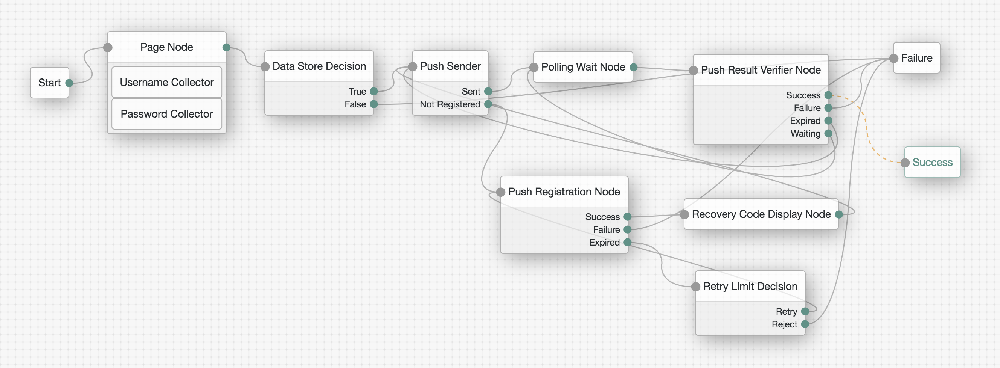

<!--
 * The contents of this file are subject to the terms of the Common Development and
 * Distribution License (the License). You may not use this file except in compliance with the
 * License.
 *
 * You can obtain a copy of the License at legal/CDDLv1.0.txt. See the License for the
 * specific language governing permission and limitations under the License.
 *
 * When distributing Covered Software, include this CDDL Header Notice in each file and include
 * the License file at legal/CDDLv1.0.txt. If applicable, add the following below the CDDL
 * Header, with the fields enclosed by brackets [] replaced by your own identifying
 * information: "Portions copyright [year] [name of copyright owner]".
 *
 * Copyright 2017 ForgeRock AS.
-->
<b>Push Notification Registration Node</b>
 
An authentication node which allows registration of a mobile device for use with the Push Authentication node. When the 
node is first visited, the user is displayed with a QR code to be scanned by the device they wish to register. The node 
will send a push notification to the device and await a response. Upon receiving a response, if the configuration has 
been set to generate recovery codes they will be placed into the transient state for use with a subsequent node, a 
device profile will be saved to the user's entry in the identity store, and the node will continue to the 'Success' 
outcome. In the event that the user doesn't respond to the push notification within the limit (defined in the AM 
management console) then the 'expired' outcome will be selected.
 
 
<b>Installation</b>
 
Copy the .jar file from the ../target directory into the ../web-container/webapps/openam/WEB-INF/lib directory where AM is deployed.  Restart the web container to pick up the new node.  The node will then appear in the authentication trees components palette.
 
 
<b>Usage</b>
 
The node should be added to an authentication tree and assumes username is available in shared state, e.g. place the registration node after a Username Collector node. If required, the registration node can be followed with a push sender and push verification node as confirmation.
 
 
<b>To Build</b>
 
To build, run "mvn clean install" in the directory containing the pom.xml
 
 
 

 
 
<b>Disclaimer</b>
The sample code described herein is provided on an "as is" basis, without warranty of any kind, to the fullest extent permitted by law. ForgeRock does not warrant or guarantee the individual success developers may have in implementing the sample code on their development platforms or in production configurations.

ForgeRock does not warrant, guarantee or make any representations regarding the use, results of use, accuracy, timeliness or completeness of any data or information relating to the sample code. ForgeRock disclaims all warranties, expressed or implied, and in particular, disclaims all warranties of merchantability, and warranties related to the code, or any service or software related thereto.

ForgeRock shall not be liable for any direct, indirect or consequential damages or costs of any type arising out of any action taken by you or others related to the sample code.
